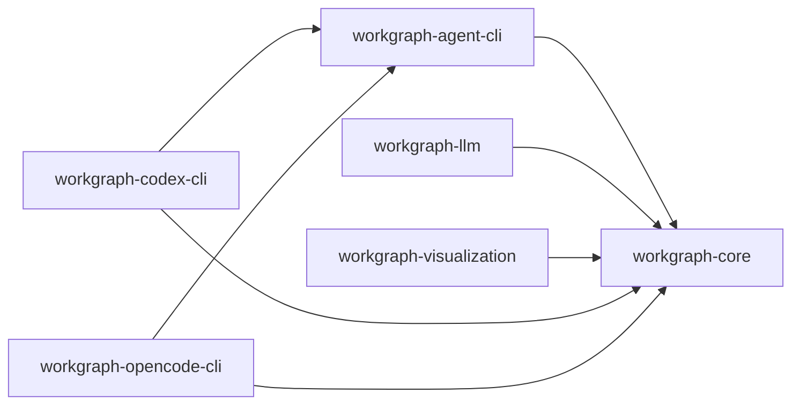

# Workgraph

Workgraph is a family of MoonBit modules for asynchronous typed graphs, LLM nodes, coding agents, CLI integrations, and visualization.

## Modules

| Module                              | Responsibility                                                                                                | Preferred target | Supported targets |
| ----------------------------------- | ------------------------------------------------------------------------------------------------------------- | ---------------- | ----------------- |
| `totto2727/workgraph-core`          | Graph definitions, compiled graphs, sequential runtime, state reducers, events, and in-memory `ResourceStore` | wasm             | js, native, wasm  |
| `totto2727/workgraph-agent-cli`     | Coding-agent node and session resource lifecycle                                                              | wasm             | js, native, wasm  |
| `totto2727/workgraph-llm`           | Provider-neutral `mizchi/llm@0.3.1` node boundary                                                             | js               | js, native        |
| `totto2727/workgraph-visualization` | Mermaid rendering from compiled graph snapshots                                                               | wasm             | js, native, wasm  |
| `totto2727/workgraph-codex-cli`     | Codex CLI adapter                                                                                             | native           | wasm, native      |
| `totto2727/workgraph-opencode-cli`  | OpenCode CLI adapter                                                                                          | native           | wasm, native      |

Production dependency direction is acyclic:



Each module owns its unit and integration tests. The previous shared `testing`, aggregate `test`, and `e2e` packages are not part of the split module family.

## Examples

Run commands from the repository root.

```bash
moon run package/workgraph-core/src/examples/basic
moon run package/workgraph-llm/src/examples/basic
moon run package/workgraph-visualization/src/examples/basic
moon run package/workgraph-codex-cli/src/examples/basic
moon run package/workgraph-opencode-cli/src/examples/basic
```

The LLM example uses `mizchi/llm.MockProvider` and requires no credentials. The Codex and OpenCode examples use the corresponding installed CLI and local authentication. `workgraph-agent-cli` has no standalone example because the two CLI examples demonstrate its concrete use.

## Development

```bash
moon check
moon test
```

See the [architecture](docs/architecture.md), [core guide](docs/core-guide.md), [interfaces](docs/interfaces.md), and [testing guide](docs/testing.md).
