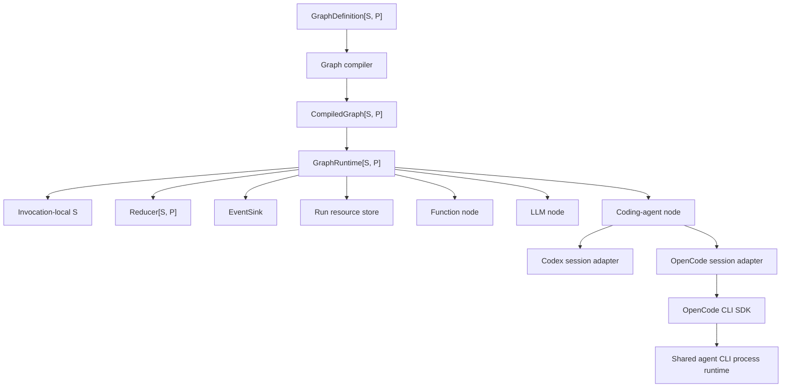
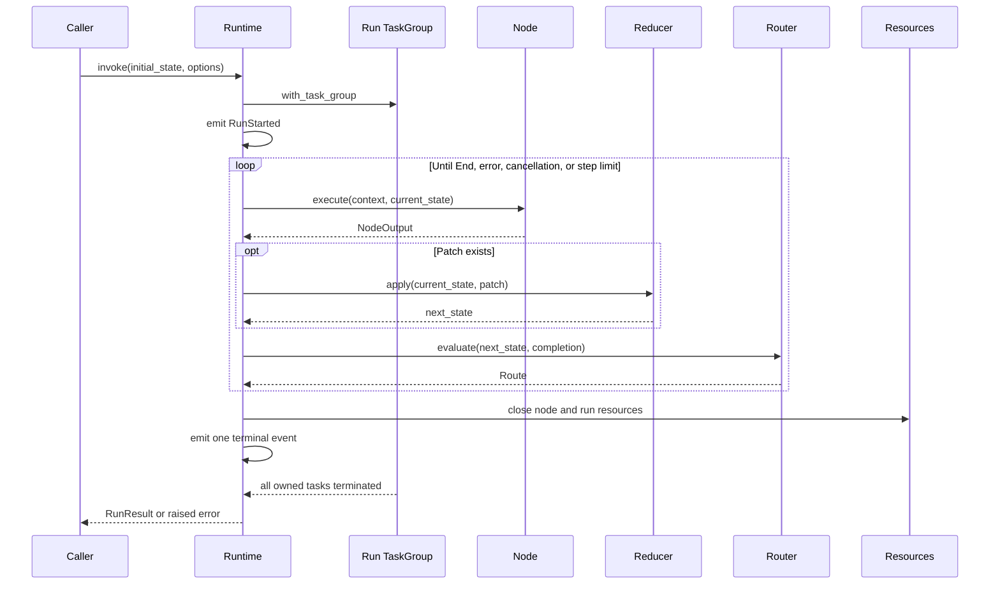

# Workgraphアーキテクチャ

## ステータス

このドキュメントは、Workgraphモジュール群の現在のアーキテクチャを記録します。

実装ベースラインでは、型付きLLMメッセージ、ツール、プロバイダー結果、テストプロバイダーに `mizchi/llm@0.3.1` を使用します。CodexとOpenCodeは引き続きnative SDK統合です。

core runtime、LLM node、visualizationモジュールはnativeとJavaScript targetをサポートします。coding-agentとCLI integrationモジュールはnativeのみです。

## 実装状況

実装はランタイム非依存のcore、LLM、visualizationモジュールと、nativeのcoding-agentおよびCLI integrationモジュールに分割されています。各モジュールが自身のテストとexampleを所有します。

先送りされた作業には、並列ノードスケジューリング、永続的チェックポイントまたは耐久性のある実行、人間による承認の一時停止、サブグラフ、分散ワーカー、プロバイダー完全な権限マッピング、および実際のクレデンシャルを持つプロバイダーによるエンドツーエンドテストが含まれます。

## 目的

ランタイムは、その遷移が検証された有向グラフを形成する型付きステートマシンを実行します。

MVP は次の3つの実行セマンティクスをサポートします。

- ファンクションノードは、任意の MoonBit コールバックを実行します。
- LLMノードは、注入されたmizchi/llm providerを呼び出してresultを収集します。
- コーディングエージェントノードは、Codex または OpenCode のいずれかにワークスペース作業を委任します。

ノードカテゴリは、トランスポートではなく実行セマンティクスに基づいています。

## レビュー済みの決定事項

元の設計方針は、以下の修正を加えて維持されます。

1. モジュールは `preferred_target = "native"` と `supported_targets = "native"` の両方を宣言します。
2. すべての非同期処理は `moonbitlang/async` の構造化並行処理を使用します。
3. 各グラフ呼び出しは1つのタスクグループを所有し、その呼び出しのために生成されたすべてのサブプロセスまたはバックグラウンドタスクはそのグループに属します。
4. キャンセルは `moonbitlang/async` のタスクキャンセルを使用します。MVP は2つ目のキャンセルトークンの抽象化を導入しません。
5. 非同期 API は MoonBit のエラーを発生させます。すべての結果を `Result` でラップすることはありません。
6. ドメイン障害は `suberror` 値を使用し、予期しない低レベルのエラーは `Error` の原因として保持されます。
7. ジェネリックなグラフコールバックは型付き関数フィールドを使用します。なぜなら、その状態とパッチの型はグラフ固有だからです。
8. MVP では、ノードは最大1つのルーターを持ちます。これにより、複数の outgoing エッジ間の順序の曖昧さが排除されます。
9. ルーターは可能なすべての宛先ノード ID を宣言するため、コンパイル時に到達可能性と宛先を検証できます。
10. インメモリの実行状態は呼び出しによって直接所有されます。耐久性のある、またはプラグイン可能な状態ストアは、チェックポイントが設計されるまで先送りされます。
11. OpenCode は、リポジトリの CLI SDK を利用したコーディングエージェントアダプターであり、`opencode run --format json` を実行します。別の `opencode-server-sdk` はグラフアダプターの一部ではありません。
12. すべての Codex または OpenCode のターンは、構造化並行処理を通じて独自の CLI サブプロセスを所有し、呼び出し元のキャンセルはその子プロセスを停止して待機してから戻る必要があります。

## コンポーネントモデル



コアランタイムは、Codex、OpenCode、またはLLMの具象型をインポートしません。

統合パッケージは、それらの具象 SDK をコアのコールバックおよびセッション契約に適応させます。

ランタイムは各呼び出しに `TaskGroup[Unit]` を使用するため、プロセスの所有権はグラフの状態型に依存しません。

## ネイティブ非同期実行モデル

`GraphRuntime::invoke` は非同期操作です。

呼び出しはネストされたタスクグループを開き、そのボディ内で完全な実行を行います。

タスクグループは以下を所有します。

- ランタイムによって生成されたノード処理。
- ターン中に開始された Codex サブプロセス。
- ターン中に開始された OpenCode サブプロセス。
- タイムアウトヘルパータスク。
- 任意のアダプターバックグラウンドリーダー。

MVP はノードを逐次的に実行しますが、プロセスの所有権、キャンセル、タイムアウト、および将来の限定された並列実行のために、構造化並行処理は依然として必要です。

呼び出し元は、呼び出し元が所有するタスクグループ内で呼び出しを spawn し、返された `Task` をキャンセルすることで、呼び出しをキャンセルできます。

```moonbit
@async.with_task_group() <| group => {
  let task = group.spawn(async fn() { runtime.invoke(initial_state, options) })
  // 呼び出し元は後で task.cancel() を呼び出せます。
  task.wait()
}
```

ランタイムは、キャンセルエラーを飲み込んで通常の成功結果に変換してはいけません。

キャッチオールループは、再試行または継続する前に `@async.is_being_cancelled()` をチェックします。

## 実行ライフサイクル



ルーターはパッチ適用後の状態を観測します。

ステップカウンターは、ノード実行の試行ごとに正確に1回インクリメントされます。

`max_steps = 0` は、エントリーノードを実行する前に実行を拒否します。

## クリーンアップとエラーの保持

リソースのクリーンアップは、成功、失敗、タイムアウト、およびキャンセル時に実行されます。

実行本体は、`@async.with_task_group` から戻る前に、実行スコープのリソースを明示的にクローズします。

非同期 I/O を実行するクリーンアップは、呼び出し元のキャンセルから保護され、ハードタイムアウトによって制限されます。

```moonbit
@async.protect_from_cancel(
  async fn() {
    @async.with_timeout(
      cleanup_timeout_ms,
      async fn() { resources.close_all() },
    )
  },
)
```

保護は可能な限り狭い範囲に保ちます。広範なキャンセル保護は、タイムアウトとキャンセルの抽象化を壊す可能性があるためです。

リソースは取得の逆順でクローズされます。

主要な処理とクリーンアップの両方が失敗した場合、主要なエラーが優先され、クリーンアップエラーはランタイム障害レコードに付加されます。

クリーンアップのみが失敗した場合、実行はクリーンアップエラーで失敗します。

ランタイムは、1つのクローズ操作が失敗した後も、残りのリソースのクローズを続行します。

## グラフセマンティクス

グラフ定義は、組み立て中はミュータブルです。

コンパイルは、推移的に不変なグラフ構造の値をプライベートな永続 HashMap に格納します。その後に定義を変更してもビルダーのエントリが置き換わるだけで、コンパイル済みグラフから到達可能な値は変更できません。

コンパイルは以下を検証します。

- 空でないエントリーノードが設定されていること。
- ノード ID が一意であること。
- エントリーノードが存在すること。
- すべてのノードが正確に1つのルーターを持つこと。
- 宣言されたすべてのルーター宛先が存在すること。
- すべてのノードがエントリーノードから宣言された宛先を通じて到達可能であること。
- ID が有効であること。

サイクルは許可されます。

コンパイルされたグラフは、ミュータブルな内部マップや配列を公開しません。

MVP は、ルーターの宣言された宛先リストから省略された動的な宛先をサポートしません。

## ステートセマンティクス

状態型とパッチ型は、グラフ作成者によって提供されます。

ノードは状態値を読み取り、パッチを返す場合があります。

リデューサーは、状態を変更する唯一のランタイムパスです。

リデューサーは同期的かつ決定論的です。

呼び出しは現在の状態をローカルに保持します。これは、MVP が逐次的で非耐久性だからです。

チェックポイント、サスペンド/レジューム、および永続的ストアは、別個の一貫性とシリアライゼーションの設計を必要とし、MVP の一部ではありません。

## ノードセマンティクス

### ファンクションノード

ファンクションノードは、非同期の MoonBit コールバックをラップします。

I/O を実行することもありますが、ルーティングのみのロジックはルーターに属します。

`NodeContext.deadline_ms` は、ノードタイムアウトが設定されていない場合は `None` であり、設定されている場合はノードタイムアウト期間をミリ秒単位の `Int64` として保持します。これは現在のノード試行のメタデータであり、絶対的な壁時計のデッドラインではありません。ランタイムは、`@async.with_timeout` を使用して同じ設定された期間を強制します。

### LLM ノード

LLM ノードは以下を実行します。

- 状態からmizchi/llmのメッセージ型とツール型を使用した型付き `LlmRequest` を構築します。
- 設定されたproviderを呼び出してstreamを収集します。
- レスポンスをノード出力にデコードします。

ノードはmizchi/llm `CollectResult` を生成するため、グラフ作成者が必要とする場合、そのデコーダーはテキスト、ツール呼び出し、終了理由、使用量を型付きpatch、graph state、またはoptional node valueに保持できます。ノードは使用量を自動的には出力しません。

呼び出し側がproviderの生成とtarget固有のtransport設定を所有し、`workgraph-llm` が呼び出し、stream収集、stream error変換を所有します。

テストはopenなmizchi/llm `Provider` traitの任意の決定論的実装を渡せます。

`workgraph-llm` はrequest構築後かつprovider呼び出し前に一度yieldし、待機中のcancellationがtransport開始前にnodeを停止できるようにします。`mizchi/llm@0.3.1` の `Provider::stream` は同期APIのため、transport開始後の中断はcore task timeoutではなくproviderに設定したtimeoutに依存します。

注入するproviderは、appが管理する信頼済みコードとして扱います。stream errorのmessageは呼び出し側の診断用に `LlmNodeError::ProviderFailed` へ保持するため、graph failureを信頼できないclientへ公開するappは、その境界でredactする必要があります。同期provider呼び出しはgraph runtimeで隔離できないため、response sizeとtransport durationはproviderのtoken設定とtimeout設定で制限する必要があります。

### コーディングエージェントノード

コーディングエージェントノードは以下を実行します。

- 共通のコーディングエージェントリクエストを構築します。
- プロセスを通常の型付きリソースとして保存し、リソーススコープに従って取得または再利用します。
- リクエストを実行します。
- レスポンスをpatchとoptional valueに変換します。

Codex と OpenCode はセッションセマンティクスを共有しますが、SDK 固有のオプションはアダプター内に保持します。

## Codex アダプター

Codex アダプターは、共通リクエストをリポジトリの `totto2727/codex-sdk` にマッピングします。

Codex セッションは1つの `Thread` を所有します。

`Thread::run` および `Thread::run_streamed` は、ターンごとにネイティブサブプロセスを開始およびクリーンアップします。

タスクキャンセルは、上流のアボートシグナルに相当するネイティブのものです。

Codex スレッドの継続は `Thread::id` を使用します。

現在の SDK イベントモデルが実際にそのデータを公開しない限り、アダプターは stdout、stderr、または変更されたファイルデータを約束してはいけません。

## OpenCode アダプター

OpenCode アダプターは以下を所有します。

- 1つのリポジトリ `@opencode_sdk.Thread`。
- 各ターンに適用されるワーキングディレクトリとスレッドオプション。
- JSONL イベントから学習された、または再開用に提供された論理的な OpenCode セッション ID。
- セッションミューテックスと論理的なクローズ状態。

リポジトリの `totto2727/opencode-sdk` は OpenCode CLI SDK です。これは `opencode run --format json` を呼び出します。一方、`totto2727/opencode-server-sdk` はオプションの `opencode serve` ライフサイクルを別途所有し、Workgraph によってインポートされることはありません。

アダプターは、オープン時に CLI スレッドを作成または再開します。各 `execute` は `Thread::run` を呼び出し、これは1つのネイティブサブプロセスを開始し、型付き JSONL イベントを解析し、最終テキストをキャプチャし、次のターン用に出力されたセッション ID を保持します。

相対コンテキストファイルはワークスペースルートに対して解決され、型付きローカルファイル入力として渡されるため、SDK は繰り返し `--file` フラグを出力します。指示はファイルパスをテキストに埋め込む代わりに、CLI プロンプトのまま残ります。

アダプターは継承されたプロセス環境をスナップショットし、設定されたアダプター変数を適用し、次にオープンコンテキスト環境を適用して、呼び出し元の値を優先します。実行可能パス、型付き設定、再開 ID、モデル、エージェント、ワーキングディレクトリ、バリアント、タイトル、および思考オプションを CLI SDK にマッピングします。

アイドルスレッドに属する永続的なサブプロセスがないため、セッションクローズは論理的です。実行中の処理は `agent-cli-sdk` 内でその子プロセスを所有します。キャンセルはその子プロセスをハードストップして待機します。一方、CLI の終了、JSONL、およびターンの失敗は、具象の `OpenCodeSdkError` を保持します。クローズされたセッションは `OpenCodeAdapterError::SessionClosed` を発生させます。

## パッケージレイアウト

実装は6つの非循環MoonBitモジュールで構成されます。

```text
mbt/package/
├── workgraph-core/
├── workgraph-agent-cli/
├── workgraph-llm/
├── workgraph-visualization/
├── workgraph-codex-cli/
└── workgraph-opencode-cli/
```

`workgraph-core`には、ID、グラフコンパイル、ノードおよびルーターcallback container、reducer semantics、run event、run resource、逐次runtimeが含まれます。

`workgraph-llm`はcoreと`mizchi/llm`をインポートします。

`workgraph-agent-cli`はcoreをインポートし、共通agent session契約とnode factoryを定義します。

2つのCLI adapterモジュールはcore、coding、対応する具象SDKをインポートします。

`workgraph-visualization`はcoreをインポートし、callbackを含まないcompiled graph snapshotを決定的なMermaid flowchartとしてrenderingします。テストとexampleは挙動を所有するモジュールに配置し、共有production testingモジュールやE2Eモジュールは持ちません。

グラフモジュールとnative CLI SDKはリポジトリのasyncランタイムを共有します。`mizchi/llm` にはモジュール依存がなく、グラフのasyncバージョンを制約しません。

## MVP スコープ

MVP に含まれるもの:

- ランタイム非依存モジュールのnativeおよびJavaScript非同期実行。
- ファンクション、LLM、およびコーディングエージェントノード。
- 型付き状態とパッチ。
- 条件付きルーティング。
- ステップ制限付きのサイクル。
- ノードタイムアウト。
- タスクキャンセル。
- CodingAgentプロセスを含む、実行スコープおよびノードスコープの異種リソース。
- インメモリのイベントと状態。
- Codex および OpenCode アダプター。
- モジュール所有の決定的なunit testとCLI integration coverage。

MVP から除外されるもの:

- 並列ノード実行。
- 永続的チェックポイント。
- 耐久性のある実行。
- 人間による承認の一時停止。
- サブグラフ。
- 分散ワーカー。
- プロバイダー完全な権限マッピング。
- 実際のクレデンシャルを持つプロバイダーによるエンドツーエンドテスト。

## 参考文献

- [MoonBit 非同期プログラミングと構造化並行処理](https://docs.moonbitlang.com/en/latest/language/async-experimental.html)
- [MoonBit エラーハンドリング](https://docs.moonbitlang.com/en/latest/language/error-handling.html)
- [MoonBit メソッド、トレイト、およびトレイトオブジェクト](https://docs.moonbitlang.com/en/latest/language/methods.html)
- [MoonBit モジュール設定とネイティブターゲット宣言](https://docs.moonbitlang.com/en/latest/toolchain/moon/module.html)
- [MoonBit パッケージ設定](https://docs.moonbitlang.com/en/latest/toolchain/moon/package.html)
- [moonbitlang/async パッケージドキュメント](https://mooncakes.io/docs/moonbitlang/async)
- [mizchi/llm パッケージ](https://mooncakes.io/docs/mizchi/llm@0.3.1)
- [リポジトリの移植元である Codex TypeScript SDK リファレンス](https://github.com/openai/codex/tree/f201c30c52a35f819262865a53df94b6f4ea7a50/sdk/typescript)
- [OpenCode CLI ドキュメント](https://opencode.ai/docs/cli/)
- [リポジトリ CLI SDK の移植元である OpenCode `run` JSONL 実装](https://github.com/anomalyco/opencode/blob/1e17856ba4b5b052650c8115060852f3f023844e/packages/opencode/src/cli/cmd/run.ts)
