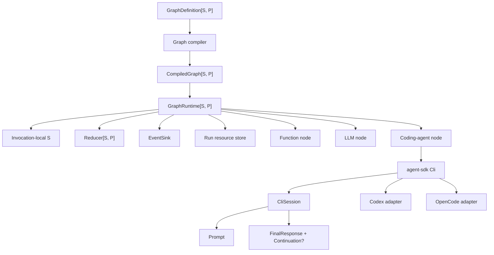
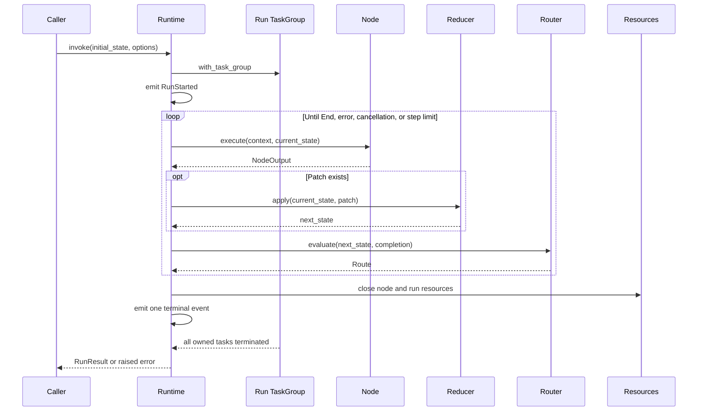

# Workgraph Architecture

## Status

This document records the current architecture of the Workgraph module family.

The implementation baseline uses `mizchi/llm@0.3.1` for typed LLM messages, tools, provider results, and test providers. Coding-agent nodes use registry-resolved `agent-sdk@0.2.0`; Codex and OpenCode provider options use their respective `0.4.0` SDKs. The CLI integrations use the same production source for Wasm/WASI and native, with fake process tests restricted to native and real credentialed smoke tests optional.

The core runtime, coding-agent, visualization, Codex CLI, and OpenCode CLI modules prefer Wasm/WASI. Core and visualization support JavaScript, native, and Wasm/WASI; coding-agent, Codex CLI, and OpenCode CLI support Wasm/WASI and native, but not JavaScript. The LLM module prefers JavaScript and supports JavaScript and native because its `mizchi/llm` dependency uses aborting stubs on Wasm.

## Implementation Status

The implementation is split into runtime-independent core, coding-agent, LLM, and visualization modules plus same-source Codex and OpenCode CLI integration modules. Each module owns its tests and examples.

Deferred work includes parallel node scheduling, persistent checkpoints or durable execution, human approval suspension, subgraphs, distributed workers, provider-complete permission mapping, and real credentialed provider end-to-end tests.

## Purpose

The runtime executes a typed state machine whose transitions form a validated directed graph.

The MVP supports three execution semantics:

- A function node runs an arbitrary MoonBit callback.
- An LLM node invokes a supplied mizchi/llm provider and collects its result.
- A coding-agent node delegates workspace work to either Codex or OpenCode.

Node categories are based on execution semantics rather than transport.

## Reviewed Decisions

The original design direction is retained with the following corrections.

1. Core and visualization support JavaScript, native, and Wasm/WASI; coding-agent, Codex CLI, and OpenCode CLI prefer Wasm/WASI and support Wasm/WASI and native, but not JavaScript; the LLM module supports JavaScript and native.
2. All asynchronous work uses `moonbitlang/async` structured concurrency.
3. Each graph invocation owns one task group, and every subprocess or background task created for that invocation belongs to that group.
4. Cancellation uses task cancellation from `moonbitlang/async`; the MVP does not introduce a second cancellation-token abstraction.
5. Asynchronous APIs raise MoonBit errors; they do not wrap every result in `Result`.
6. Domain failures use `suberror` values, while unexpected lower-level errors are preserved as `Error` causes.
7. Generic graph callbacks use typed function fields because their state and patch types are graph-specific.
8. A node has at most one router in the MVP, which removes ordering ambiguity between multiple outgoing edges.
9. A router declares all possible destination node IDs so compilation can validate reachability and destinations.
10. In-memory run state is owned directly by an invocation; a durable or pluggable state store is deferred until checkpointing is designed.
11. OpenCode is a coding-agent adapter backed by the repository's CLI SDK, which runs `opencode run --format json`; the separate `opencode-server-sdk` is not part of the graph adapter.
12. Every Codex or OpenCode turn owns its CLI subprocess through structured concurrency, and caller cancellation must stop and await that child before returning.

## Component Model



The core runtime does not import Codex, OpenCode, or LLM concrete types.

The integration packages return configured agent-sdk `Cli` values; `workgraph-agent-cli` owns node-scoped or run-scoped session acquisition and the Workgraph node contract.

The runtime uses `TaskGroup[Unit]` for each invocation so process ownership does not depend on the graph's state type.

## Native Async Execution Model

`GraphRuntime::invoke` is an async operation.

An invocation opens a nested task group and performs the complete run inside its body.

The task group owns:

- Node work spawned by the runtime.
- Codex subprocesses started during turns.
- OpenCode subprocesses started during turns.
- Timeout helper tasks.
- Any adapter background readers.

The MVP executes nodes sequentially, but structured concurrency is still required for process ownership, cancellation, timeouts, and future bounded parallelism.

The caller may cancel an invocation by spawning it in a caller-owned task group and cancelling the returned `Task`.

```moonbit
@async.with_task_group() <| group => {
  let task = group.spawn(async fn() { runtime.invoke(initial_state, options) })
  // A caller may later invoke task.cancel().
  task.wait()
}
```

The runtime must not swallow the cancellation error and convert it into an ordinary successful result.

Catch-all loops check `@async.is_being_cancelled()` before retrying or continuing.

## Run Lifecycle



The router observes the state after patch reduction.

The step counter is incremented exactly once for every node execution attempt.

`max_steps = 0` rejects the run before executing the entry node.

## Cleanup and Error Preservation

Resource cleanup runs on success, failure, timeout, and cancellation.

The run body explicitly closes run-scoped resources before it returns from `@async.with_task_group`.

Cleanup that performs async I/O is protected from the caller's cancellation and bounded by a hard timeout.

```moonbit
@async.protect_from_cancel(
  async fn() {
    @async.with_timeout(
      cleanup_timeout_ms,
      async fn() { resources.close_all() },
    )
  },
)
```

Protection is kept as narrow as possible because broad cancellation protection can break timeout and cancellation abstractions.

Resources close in reverse acquisition order.

If primary work and cleanup both fail, the primary error remains primary and cleanup errors are attached to the runtime failure record.

If only cleanup fails, the run fails with a cleanup error.

The runtime continues closing remaining resources after one close operation fails.

## Graph Semantics

A graph definition is mutable while being assembled.

Compilation stores the graph's transitively immutable structural values in private persistent hash maps. Later mutations of the definition can replace builder entries but cannot mutate values already reachable from the compiled graph.

Compilation validates:

- A non-empty entry node is configured.
- Node IDs are unique.
- The entry node exists.
- Every node has exactly one router.
- Every declared router destination exists.
- Every node is reachable from the entry node through declared destinations.
- IDs are valid.

Cycles are allowed.

The compiled graph does not expose mutable internal maps or arrays.

The MVP does not support dynamic destinations that were omitted from a router's declared destination list.

## State Semantics

State and patch types are supplied by the graph author.

A node reads a state value and may return a patch.

The reducer is the only runtime path that changes state.

The reducer is synchronous and deterministic.

The invocation keeps the current state locally because the MVP is sequential and non-durable.

Checkpointing, suspend/resume, and persistent stores require a separate consistency and serialization design and are not part of the MVP.

## Node Semantics

### Function Node

A function node wraps an async MoonBit callback.

It may perform I/O, but routing-only logic belongs in the router.

`NodeContext.deadline_ms` is `None` when no node timeout is configured and otherwise contains the configured node timeout duration in milliseconds as `Int64`; it is metadata for the current node attempt, not an absolute wall-clock deadline. The runtime enforces the same configured duration with `@async.with_timeout`.

### LLM Node

An LLM node:

- Builds a typed `LlmRequest` from state using mizchi/llm message and tool types.
- Invokes the configured provider and collects its stream.
- Decodes the response into a node output.

The node produces a mizchi/llm `CollectResult`, so its decoder can preserve text, tool calls, finish reason, and usage information in the typed patch, graph state, or optional node value; the node does not automatically emit usage.

The caller owns provider construction and target-specific transport configuration, while `workgraph-llm` owns invocation, stream collection, and stream-error conversion.

Tests can supply any deterministic implementation of the open mizchi/llm `Provider` trait.

`workgraph-llm` yields once after request construction and before provider invocation so queued cancellation can stop the node before transport starts. In `mizchi/llm@0.3.1`, `Provider::stream` is synchronous; after transport starts, interruption depends on the provider's configured timeout rather than the core task timeout.

The injected provider is trusted application code. Its stream-error message is retained in `LlmNodeError::ProviderFailed` for the caller's diagnostics; applications that expose graph failures to untrusted clients must redact them at that boundary. Response size and transport duration must be bounded through the provider's token and timeout configuration because the synchronous provider call cannot be isolated by the graph runtime.

### Coding-Agent Node

A coding-agent node selects a `CodingAgentContinuation?`, validates its owner, opens a configured `Cli`, and creates a workspace-resolved `Prompt`. It calls `Cli.start()` when no continuation is selected or `Cli.continue_session()` when one is selected, exactly once while acquiring its resource. The resource key includes both the visible key and `CodingAgentId`, so different agents cannot share a session accidentally. The node serializes `CliSession.prompt` with its own mutex and passes the direct `FinalResponse` plus its owned continuation token to the decoder.

The resource finalizer is deliberately a no-op because agent-sdk has no idle `CliSession` close operation. Provider cleanup belongs to the cancellable `prompt` call; cancellation propagates after cleanup. A `CodingAgentContinuation` is opaque, in-process only, and bound to its producing `CodingAgentId`, so it is neither a durable checkpoint nor a cross-agent value. Graph nodes execute sequentially, and separately configured Codex, OpenCode, or custom agents retain isolated sessions, state slots, and continuations.

## Codex Adapter

The Codex adapter returns a configured `Cli` from `CodingAgent.open`, using `totto2727/codex-sdk/cli` only for provider-native options. The node owns `CliSession` lifecycle, mutex, and continuation selection; `FinalResponse` remains provider-neutral.

## OpenCode Adapter

The OpenCode adapter returns a configured `Cli`; it does not own a Workgraph session, mutex, or logical closed state.

The repository's `totto2727/opencode-sdk` is the OpenCode CLI SDK. It invokes `opencode run --format json`, while `totto2727/opencode-server-sdk` separately owns optional `opencode serve` lifecycle and is not imported by Workgraph.

The node creates or resumes an agent-sdk CLI session during resource acquisition. Each `prompt` sends a common `Prompt` and passes its `FinalResponse` to the node decoder.

Relative context files are resolved against the workspace root before being passed in the common prompt.

The adapter snapshots the inherited process environment, applies configured adapter variables, then applies the open context environment with caller values taking precedence. It maps executable path, typed config, resume ID, model, agent, working directory, variant, title, and thinking options to the CLI SDK.

Cancellation and CLI failures propagate through agent-sdk. There is no Workgraph post-close error because Workgraph does not expose a logical session close operation.

## Package Layout

The implementation consists of six acyclic MoonBit modules.

```text
package/
├── workgraph-core/
├── workgraph-agent-cli/
├── workgraph-llm/
├── workgraph-visualization/
├── workgraph-codex-cli/
└── workgraph-opencode-cli/
```

`workgraph-core` contains IDs, graph compilation, node and router callback containers, reducer semantics, run events, run resources, and the sequential runtime.

`workgraph-llm` imports core and `mizchi/llm`.

`workgraph-agent-cli` imports core and `agent-sdk/cli`, defines the direct `Cli` node contract, and owns session resource acquisition.

The two CLI adapter modules import core, coding, and their corresponding concrete SDK.

`workgraph-visualization` imports core and renders callback-free compiled graph snapshots as deterministic Mermaid flowcharts. Tests and examples live in the module that owns their behavior; there is no shared production testing or E2E module.

The graph module and native CLI SDKs share the repository async runtime. `mizchi/llm` has no module dependencies and does not constrain the graph async version.

## MVP Scope

The MVP includes:

- Native and JavaScript async execution for core and visualization; Wasm/native execution for coding-agent and CLI adapters.
- Function, LLM, and coding-agent nodes.
- Typed state and patches.
- Conditional routing.
- Cycles with a step limit.
- Node timeout.
- Task cancellation.
- Run-scoped and node-scoped heterogeneous resources, including coding-agent processes.
- In-memory events and state.
- Codex and OpenCode adapters.
- Module-owned deterministic unit and CLI integration coverage.

The MVP excludes:

- Parallel node execution.
- Persistent checkpoints.
- Durable execution.
- Human approval suspension.
- Subgraphs.
- Distributed workers.
- Provider-complete permission mapping.
- Real credentialed provider end-to-end tests.

## References

- [MoonBit async programming and structured concurrency](https://docs.moonbitlang.com/en/latest/language/async-experimental.html)
- [MoonBit error handling](https://docs.moonbitlang.com/en/latest/language/error-handling.html)
- [MoonBit methods, traits, and trait objects](https://docs.moonbitlang.com/en/latest/language/methods.html)
- [MoonBit module configuration and target declarations](https://docs.moonbitlang.com/en/latest/toolchain/moon/module.html)
- [MoonBit package configuration](https://docs.moonbitlang.com/en/latest/toolchain/moon/package.html)
- [agent-sdk 0.2.0 source](https://github.com/totto2727-org/agent-sdk/tree/9abf45ee53a543149ce19e0542733ec86d055488)
- [moonbitlang/async package documentation](https://mooncakes.io/docs/moonbitlang/async)
- [mizchi/llm package](https://mooncakes.io/docs/mizchi/llm@0.3.1)
- [Codex TypeScript SDK reference pinned by the repository port](https://github.com/openai/codex/tree/f201c30c52a35f819262865a53df94b6f4ea7a50/sdk/typescript)
- [OpenCode CLI documentation](https://opencode.ai/docs/cli/)
- [OpenCode `run` JSONL implementation pinned by the repository CLI SDK](https://github.com/anomalyco/opencode/blob/1e17856ba4b5b052650c8115060852f3f023844e/packages/opencode/src/cli/cmd/run.ts)
