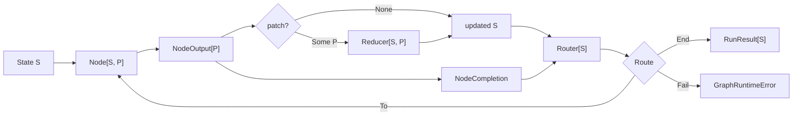

# Workgraph コア型と実行ガイド

## 対象読者と範囲

このガイドは、型付きコードを読むことに抵抗がなく、データ構造とアルゴリズムに関する学部レベルの理解を持つプログラマーを対象としています。

`core` パッケージがグラフワークフローをどのようにモデル化し、その構造を検証し、ノードを実行し、状態を更新し、ルートを選択し、リソースを所有し、失敗を報告するかを説明します。

引用された各定義または連続した抜粋は、`src/core` 配下の現在の実装からそのまま引用されており、明示的な `// ...` マーカーは抜粋内の省略された行を示します。

プロバイダー固有のLLM、Codex、OpenCodeの詳細は、コアが汎用コールバックとコーディングエージェント契約のみに依存しているため、このガイドの範囲外です。

## メンタルモデル

ランタイムは、有向グラフとして表現される型付き状態機械です。

- ノードは現在の状態 `S` を読み取り、非同期に `NodeOutput[P]` を生成します。
- オプションのパッチ `P` は `Reducer[S, P]` によって状態に畳み込まれます。
- ルーターは更新された状態とノードの完了を読み取り、次のノード、正常終了、または明示的な失敗を選択します。
- グラフは実行前に一度だけ検証されます。
- 1 回の呼び出しは一度に 1 つのノードを実行し、その非同期タスクとリソースを所有します。



型パラメータは、意図的に長期間存続する状態とノードが提案する変更を分離しています。

- `S` はすべてのノードとルーターから見える完全な状態です。
- `P` はグラフのリデューサーが受け入れるパッチ言語です。
- グラフによって、小さなパッチ列挙型、コマンドのようなパッチ、または完全な置換値を選択できます。

これはシーケンスに対するフォールドに似ていますが、ルーターがシーケンスの次の要素を動的に選択する点が異なります。

## 識別子型

このパッケージはすべての識別子を無差別な `String` として渡すことはありません。

```moonbit
pub struct NodeId(String) derive(Eq, Hash, Debug)
pub struct RunId(String) derive(Eq, Hash, Debug)
pub struct ResourceKey(String) derive(Eq, Hash, Debug)
pub struct CodingAgentId(String) derive(Eq, Hash, Debug)
pub struct SessionId(String) derive(Eq, Hash, Debug)
```

出典: `src/identifiers.mbt`

これらのタプル構造体は、コンパクトなランタイム表現を維持しながら、識別子間の誤った相互変換を防ぎます。

`Eq` と `Hash` は識別子を `Map` と `Set` の有効なキーにし、`Debug` はエラーとテストを検査可能に保ちます。

構築は境界で検証されます。

```moonbit
fn parse_id(value : String, kind : String) -> String raise IdError {
  guard !value.is_empty() else { raise EmptyId(kind~) }
  value
}

pub fn NodeId::parse(value : String) -> NodeId raise IdError {
  NodeId(parse_id(value, "NodeId"))
}
```

したがって、空の識別子は後で失敗する無効なグラフキーになる代わりに、即座に失敗します。

## ノード、出力、リデューサー、ルーター、ルート

中心的な実行型は `Node[S, P]` です。

```moonbit
pub(all) struct Node[S, P] {
  id : NodeId
  metadata : NodeMetadata
  execute : async (NodeContext, S) -> NodeOutput[P]
}
```

出典: `src/model.mbt`

`execute` フィールドは、大規模な継承階層ではなく、非同期の型付き関数です。

ノードは現在の状態の読み取り専用の値を受け取り、その結果を記述するデータを返します。

```moonbit
pub(all) struct NodeOutput[P] {
  patch : P?
  value : Json?
  artifacts : ReadOnlyArray[Artifact]
}
```

3 つの出力フィールドには異なる目的があります。

- `patch` は型付きの状態遷移の提案です。
- `value` はルーティング、可観測性、または統合ペイロードのためのオプションの型なしの結果です。
- `artifacts` は生成されたファイル、ディレクトリ、テキスト、JSON、またはコマンドログを記録します。

状態の変更はリデューサーに集中化されています。

```moonbit
pub(all) struct Reducer[S, P] {
  apply : (S, P) -> S raise
}
```

この設計により、ノードはランタイムが所有する状態を直接変更することなく変更を記述できます。

リデューサーは `(state, patch)` を次の状態に変換する唯一の操作であり、遷移ルールのテストと監査が容易になります。

ルーティングも独立した関数です。

```moonbit
pub(all) enum Route {
  To(NodeId)
  End
  Fail(String)
} derive(Debug)
```

```moonbit
pub(all) struct Router[S] {
  metadata : RouterMetadata
  declared_routes : ReadOnlyArray[DeclaredRoute]
  evaluate : (S, NodeCompletion) -> Route raise
}
```

各 `DeclaredRoute` は実行用の宛先とオプションの `DeclaredRouteMetadata` を組み合わせます。`declared_routes` は、`evaluate` が返す可能性のあるすべての `To` 結果の静的な過大近似です。

これは、ノードが実行される前に宛先と到達可能性を検証するために必要な情報をコンパイラに提供します。

`evaluate` は依然として、更新された状態と現在のノードの完了から動的な決定を行います。

## ノードコンテキスト

ランタイムはノードの試行ごとに新しいコンテキストを構築します。

```moonbit
pub(all) struct NodeContext {
  run_id : RunId
  node_id : NodeId
  step : Int
  deadline_ms : Int64?
  task_group : @async.TaskGroup[Unit]
  events : EventSink
  resources : ResourceStore
}
```

出典: `src/model.mbt`

コンテキストはグローバル変数ではなく実行機能を運びます。

- `run_id`、`node_id`、`step` は現在の試行を識別します。
- `deadline_ms` は設定されたノードタイムアウトを公開します。
- `task_group` はアダプターに子タスクとプロセスの構造化された所有権を提供します。
- `events` は同期のベストエフォートな可観測性を公開します。
- `resources` は呼び出しの型付き異種リソースストアを公開します。

同じ呼び出しレベルのタスクグループがすべてのノードに渡されるため、キャンセルは実行全体に伝播します。

## グラフの構築とコンパイル

`GraphDefinition[S, P]` は可変の構築フェーズです。

```moonbit
pub struct GraphDefinition[S, P] {
  reducer : Reducer[S, P]
  nodes : Map[NodeId, Node[S, P]]
  routers : Map[NodeId, Router[S]]
  mut entry : NodeId?
}
```

出典: `src/graph.mbt`

`add_node`、`set_router`、`set_entry` は重複する定義と無効な識別子を拒否します。

`compile` は構造的検証を実行し、不変のノードとルーターの値を `CompiledGraph[S, P]` が所有する永続 HashMap に格納します。

```moonbit
pub fn[S, P] GraphDefinition::compile(
  self : GraphDefinition[S, P],
) -> CompiledGraph[S, P] raise GraphValidationError {
  let entry = self.entry.unwrap_or_error(MissingEntry)
  validate_graph(self.nodes, self.routers, entry)
  let nodes = @immut_hashmap.from_iter(self.nodes.iter())
  let routers = @immut_hashmap.from_iter(self.routers.iter())
  CompiledGraph::{ reducer: self.reducer, nodes, routers, entry }
}
```

検証は 5 つの不変条件をチェックします。

1. エントリノードが存在すること。
2. すべてのルーターのソースがノードであること。
3. すべてのノードにルーターエントリがちょうど 1 つあること。
4. 宣言されたすべての宛先がノードであること。
5. すべてのノードが宣言された宛先を通じてエントリから到達可能であること。

到達可能性はワークリスト走査によって計算されます。

```moonbit
let reachable : Set[NodeId] = Set::default()
let pending = [entry]
while pending.pop() is Some(node_id) {
  if reachable.add_and_check(node_id) {
    let value = routers[node_id]
    for route in value.declared_routes {
      if !reachable.contains(route.target) {
        pending.push(route.target)
      }
    }
  }
}
```

これは `pending` がスタックとして動作する場合の深さ優先探索です。

`V` 個のノードと `E` 本の宣言されたエッジに対して、その時間計算量は `O(V + E)` です。

`reachable` セットは `O(V)` の空間を使用しますが、`pending` は複数のエッジによって到達したノードの重複エントリを含む可能性があるため、最悪の場合 `O(E)` の空間を使用します。

したがって、追加の空間の合計上限は `O(V + E)` です。

実際のルートは将来の状態に依存するため、走査は実際のランタイムルートではなく宣言されたターゲットを使用します。

コンパイラは構造的な到達可能性を証明できますが、特定の入力状態がすべての分岐を実行することを証明することはできません。

## 逐次実行アルゴリズム

`GraphRuntime::invoke` は実行 ID を作成し、タスクグループを開き、実行ローカルのリソースストアを作成し、`run_sequential` を呼び出します。

逐次ループは 3 つの変数を保持します。

```moonbit
let mut state = initial_state
let mut current = runtime.graph.entry()
let mut steps = 0
```

出典: `src/runtime.mbt`

各反復は次の遷移を実行します。

1. `max_steps` を強制する。
2. 現在のノードを読み込む。
3. `NodeContext` を構築する。
4. `NodeStarted` を発行する。
5. オプションのタイムアウト付きでノードを実行する。
6. 実行が失敗した場合でもノードスコープのリソースを解放する。
7. `NodeCompleted` を発行する。
8. オプションのパッチを適用する。
9. 更新された状態に対してルーターを評価する。
10. 動的なルートを `declared_routes` に対してチェックする。
11. 継続、復帰、または失敗する。

状態の更新はルート評価の前に行われます。

```moonbit
match output.patch {
  Some(patch) => {
    state = (runtime.graph.reducer.apply)(state, patch) catch {
      error => raise ReduceFailed(node_id=current, step=steps, cause=error)
    }
    runtime.events.try_emit(
      StateUpdated(run_id~, node_id=current, step=steps),
    )
  }
  None => ()
}
let router = runtime.graph.get_router(current)
let route = (router.evaluate)(state, completion) catch {
  error => raise RouteFailed(node_id=current, step=steps, cause=error)
}
```

この順序により、ルーターは完了したばかりのノードの効果に基づいて分岐できます。

その後、ランタイムはルーターの静的契約を強制します。

```moonbit
match route {
  To(target) => {
    guard is_declared_target(router.declared_routes, target) else {
      raise RouteContractViolated(from=current, to=target)
    }
    current = target
  }
  End => return RunResult::{ run_id, final_state: state, steps }
  Fail(message) => raise ExplicitFailure(node_id=current, message~)
}
```

ルーターは、そのノードがグラフに存在する場合でも、宣言されていないノードに逃げることはできません。

有効な有向グラフにはサイクルが含まれる可能性があるため、`max_steps` ガードが必要です。

ガードがない場合、サイクルを繰り返し選択するルーターは無限に実行される可能性があります。

ノードのルックアップとルーターのルックアップが平均 `O(1)` のマップ操作として扱われる場合でも、`To` 遷移は現在のルーターの宣言されたターゲットを走査します。

`K` ステップについて、`D` を任意のルーター上の宣言されたターゲットの最大数とします。

最悪の場合の制御オーバーヘッドは、ユーザーのノード、リデューサー、ルーター、クリーンアップの作業を除いて `O(KD)` です。

`D` が小さな定数で制限される場合、これは `O(K)` として動作します。

## タイムアウト、キャンセル、構造化並行性

ノード実行はキャンセルエラーを保持し、通常のノード失敗をノードとステップのコンテキストでラップします。

```moonbit
let execute = async fn() {
  (node.execute)(context, state) catch {
    error if @async.is_being_cancelled() ||
      @async.is_cancellation_error(error) => raise error
    error =>
      raise GraphRuntimeError::NodeFailed(
        node_id=context.node_id,
        step=context.step,
        cause=error,
      )
  }
}
```

オプションのタイムアウトは、この操作を `@async.with_timeout` でラップします。

呼び出し自体は `@async.with_task_group` 内で実行されます。

```moonbit
@async.with_task_group() <| group => {
  let resources = ResourceStore::ResourceStore()
  self.events.try_emit(RunStarted(run_id))
  // ... implementation omitted ...
}
```

構造化並行性とは、子タスクが実行を意図せず存続するのではなく、字句的なタスクグループスコープに属することを意味します。

キャンセルは通常の失敗から分離されているため、オブザーバーは `RunFailed` ではなく `RunCancelled` を受け取ります。

クリーンアップは、キャンセルが呼び出し元に再送出される前にまだ実行されます。

これは、タスクがタスクグループ内で生成され、キャンセルが構造化タスクツリーを通じて伝播するという公式の MoonBit 非同期モデルに従っています。

## リソース所有権

呼び出しは、`any-collection`を基盤とする異種リソースストアを1つ所有します。グラフstateは独立して型付きかつシリアライズ可能なままであり、リソースには任意のプロセスローカル値を保持できます。

```moonbit
pub(all) enum ResourceScope {
  Node
  Run
} derive(Debug, Eq)
```

出典: `src/resources.mbt`

- `Node` リソースは1回のノード試行のために開かれ、そのノードの後に登録済みcleanupを実行します。
- `Run` リソースは型付き参照によってキャッシュされ、呼び出しのfinalizeが登録済みcleanupを実行するまで再利用されます。

```moonbit
pub async fn[T] ResourceStore::acquire_resource(
  self : ResourceStore,
  reference : @any_collection.AnyRef[ResourceKey, T],
  scope : ResourceScope,
  open : async () -> T,
  cleanup : async (T) -> Unit,
  owner? : NodeId,
) -> T
```

管理対象リソースは取得順序の逆順でcleanupを実行します。

後のリソースが前のリソースに依存する場合、逆順のクリーンアップが重要です。

ストアは各cleanup記録を実行前に閉じ済みとしてマークするため、ストアの観点から繰り返しのcleanupが冪等になります。

CodingAgentプロセスは通常の `CodingAgentResource` 値として `AnyRef` 経由で保存され、他の管理対象リソースと同じ `acquire_resource` を使用します。

最終クリーンアップはキャンセルから保護され、時間制限があります。

```moonbit
@async.protect_from_cancel(async fn() {
  @async.with_timeout(
    timeout_ms,
    async fn() { self.close_all() },
    error=CleanupTimedOut(timeout_ms),
  )
})
```

保護はクリーンアップが無限に実行されることを意味しません。クリーンアップタイムアウトは有効なままです。

## 一次失敗とクリーンアップ失敗

通常の非キャンセル実行とクリーンアップは同時に失敗する可能性があります。

どちらかの失敗を破棄すると診断が不完全になるため、ランタイムは両方を保持します。

```moonbit
pub(all) struct RunFailure {
  primary : Error
  cleanup : ReadOnlyArray[Error]
} derive(Debug)

pub(all) suberror GraphRuntimeError {
  // Other variants omitted.
  ResourceCleanupFailed(failure~ : RunFailure)
}
```

出典: `src/graph.mbt`

`attach_cleanup` は元の失敗を `primary` として保持し、クリーンアップ失敗を追加します。

クリーンアップのみが失敗した場合、そのクリーンアップエラーが `ResourceCleanupFailed` の一次エラーになります。

キャンセルには異なる優先順位があります。

ランタイムは時間制限付きのクリーンアップを試みてからキャンセルを再送出するため、キャンセルパスで発生したクリーンアップエラーは抑制される可能性があります。

これは、`finally` スタイルのクリーンアップ失敗がノードまたはルーティングの失敗を上書きすることを許可するよりも有益です。

## イベントと可観測性

`GraphEvent` は実行ライフサイクル、ノードライフサイクル、状態更新、ルート選択、リソースライフサイクルを記述します。

ランタイムはコールバックを通じてイベントを送信します。

```moonbit
pub(all) struct EventSink {
  emit : (GraphEvent) -> Unit raise
}

// ... constructors omitted ...

pub fn EventSink::try_emit(self : EventSink, event : GraphEvent) -> Unit {
  (self.emit)(event) catch {
    _ => ()
  }
}
```

出典: `src/model.mbt`

イベント配信は意図的にベストエフォートです。

オブザーバーの失敗はグラフのセマンティクスを変更したり、成功したノードを失敗したノードに変えたりしてはなりません。

トレードオフとして、耐久性のある監査ログを必要とする呼び出し元は、このプロセス内シンクの外側で永続化とリトライを提供する必要があります。

## コーディングエージェント境界

コアパッケージはプロバイダに依存しないセッショントレイトを公開します。

```moonbit
pub(open) trait CodingAgentSession {
  fn id(Self) -> SessionId?
  async fn execute(Self, CodingAgentRequest) -> CodingAgentResponse
  async fn close(Self) -> Unit
}

pub(all) struct CodingAgent {
  id : CodingAgentId
  open : async (CodingAgentOpenContext) -> &CodingAgentSession
}
```

出典: `src/coding_agent_contract.mbt`

したがって、グラフランタイムと共通のコーディングエージェントノードは、セッションが Codex、OpenCode、または別のプロバイダーによって実装されているかを知る必要はありません。

`open` コールバックは、実行タスクグループ、ワークスペースポリシー、承認ポリシー、ネットワークポリシー、環境、イベントシンクを受け取ります。

これはパッケージ境界での依存性逆転です。コアが必要とする能力を定義し、統合パッケージがそれを実装します。

## 動作する遷移の例

グラフの状態が完了したラベルを記録し、パッチ言語が 1 つのラベルを追加できると仮定します。

```text
initial state: labels = []
entry node: plan
plan output: patch = AddLabel("plan")
reducer result: labels = ["plan"]
plan router: To(test)
test output: patch = AddLabel("test")
reducer result: labels = ["plan", "test"]
test router: End
run result: steps = 2
```

重要な点は、ノードが次のノードを選択せず、状態を直接置き換えないことです。

実行、状態遷移、制御フロー選択は分離されたままであり、独立してテスト可能です。

## コアが保証すること

現在のコアは、コンパイルされたグラフに対して以下の特性を保証します。

- すべてのノードと宣言されたルートターゲットが存在すること。
- すべてのノードがエントリから構造的に到達可能であること。
- すべてのノードにルーターがあること。
- 宣言されていない動的な `To` ルートは拒否されること。
- 実行は最大 `max_steps` 回のノード試行後に停止すること。
- ノードスコープのリソースクリーンアップは各ノード試行後に試行され、クリーンアップ失敗は通常の非キャンセルパスで表面化されること。
- 実行スコープのファイナライズは、成功、失敗、またはキャンセル時に呼び出されること。
- クローズ失敗とクリーンアップタイムアウトは通常の非キャンセルパスで表面化される一方、キャンセルはクリーンアップ試行後に再送出され、そのクリーンアップエラーを抑制する可能性があること。
- 通常のノード、リデューサー、ルーターのエラーはノードとステップのコンテキストを保持すること。
- 同時に発生した非キャンセルの一次エラーとクリーンアップエラーは両方保持されること。
- イベントオブザーバーの失敗は実行を変更しないこと。

現在のコアは、並列スケジューリング、耐久性のあるチェックポイント、分散実行、または耐久性のあるイベント配信を保証しません。

## 関連資料

- [ランタイムアーキテクチャ](architecture.md)
- [公開インターフェース](interfaces.md)
- [テスト戦略](testing.md)
- [MoonBit の基礎](https://docs.moonbitlang.com/en/latest/language/fundamentals.html)
- [MoonBit のエラーハンドリング](https://docs.moonbitlang.com/en/latest/language/error-handling.html)
- [MoonBit の非同期プログラミング](https://docs.moonbitlang.com/en/latest/language/async-experimental.html)
