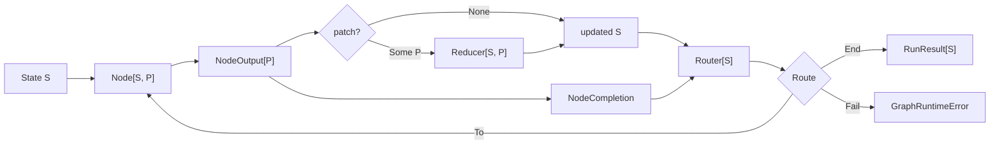

# Workgraph Core Types and Execution Guide

## Audience and Scope

This guide is for programmers who are comfortable reading typed code and have an undergraduate-level understanding of data structures and algorithms.

It explains how the `core` package models a graph workflow, validates its structure, executes nodes, updates state, selects routes, owns resources, and reports failures.

Each quoted definition or continuous excerpt is taken verbatim from the current implementation under `src/core`, and an explicit `// ...` marker identifies omitted lines inside an excerpt.

Provider-specific LLM, Codex, and OpenCode details are outside this guide because the core depends only on generic callbacks and coding-agent contracts.

## Mental Model

The runtime is a typed state machine represented as a directed graph.

- A node reads the current state `S` and asynchronously produces a `NodeOutput[P]`.
- An optional patch `P` is folded into the state by a `Reducer[S, P]`.
- A router reads the updated state and the node completion, then chooses the next node, successful termination, or explicit failure.
- The graph is validated once before execution.
- One invocation executes one node at a time and owns its asynchronous tasks and resources.



The type parameters deliberately separate long-lived state from a node's proposed change.

- `S` is the complete state visible to every node and router.
- `P` is the patch language accepted by the graph's reducer.
- Different graphs may choose a small patch enum, a command-like patch, or a complete replacement value.

This is similar to a fold over a sequence, except that the router dynamically selects the next element of the sequence.

## Identity Types

The package does not pass every identifier as an undifferentiated `String`.

```moonbit
pub struct NodeId(String) derive(Eq, Hash, Debug)
pub struct RunId(String) derive(Eq, Hash, Debug)
pub struct ResourceKey(String) derive(Eq, Hash, Debug)
pub struct CodingAgentId(String) derive(Eq, Hash, Debug)
pub struct SessionId(String) derive(Eq, Hash, Debug)
```

Source: `src/identifiers.mbt`

These tuple structs prevent accidental interchange between identifiers while retaining a compact runtime representation.

`Eq` and `Hash` make identifiers valid keys for `Map` and `Set`, and `Debug` keeps errors and tests inspectable.

Construction is validated at the boundary.

```moonbit
fn parse_id(value : String, kind : String) -> String raise IdError {
  guard !value.is_empty() else { raise EmptyId(kind~) }
  value
}

pub fn NodeId::parse(value : String) -> NodeId raise IdError {
  NodeId(parse_id(value, "NodeId"))
}
```

An empty identifier therefore fails immediately instead of becoming an invalid graph key that fails later.

## Node, Output, Reducer, Router, and Route

The central execution type is `Node[S, P]`.

```moonbit
pub(all) struct Node[S, P] {
  id : NodeId
  metadata : NodeMetadata
  execute : async (NodeContext, S) -> NodeOutput[P]
}
```

Source: `src/model.mbt`

The `execute` field is an asynchronous typed function rather than a large inheritance hierarchy.

The node receives a read-only value of the current state and returns data describing its result.

```moonbit
pub(all) struct NodeOutput[P] {
  patch : P?
  value : Json?
  artifacts : ReadOnlyArray[Artifact]
}
```

The three output fields have different purposes.

- `patch` is the typed state transition proposal.
- `value` is an optional untyped result for routing, observability, or integration payloads.
- `artifacts` records produced files, directories, text, JSON, or command logs.

State mutation is centralized in the reducer.

```moonbit
pub(all) struct Reducer[S, P] {
  apply : (S, P) -> S raise
}
```

This design makes a node describe a change without directly mutating runtime-owned state.

The reducer is the only operation that turns `(state, patch)` into the next state, which makes transition rules easier to test and audit.

Routing is also a separate function.

```moonbit
pub(all) enum Route {
  To(NodeId)
  End
  Fail(String)
} derive(Debug)
```

```moonbit
pub(all) struct Router[S] {
  metadata : RouterMetadata
  declared_routes : ReadOnlyArray[DeclaredRoute]
  evaluate : (S, NodeCompletion) -> Route raise
}
```

Each `DeclaredRoute` combines an execution target with optional `DeclaredRouteMetadata`; `declared_routes` is a static over-approximation of every `To` result that `evaluate` may return.

It gives the compiler enough information to validate destinations and reachability before any node is executed.

`evaluate` still makes the dynamic decision from the updated state and the current node's completion.

## Node Context

The runtime constructs a fresh context for every node attempt.

```moonbit
pub(all) struct NodeContext {
  run_id : RunId
  node_id : NodeId
  step : Int
  deadline_ms : Int64?
  task_group : @async.TaskGroup[Unit]
  events : EventSink
  resources : ResourceStore
}
```

Source: `src/model.mbt`

The context carries execution capabilities rather than global variables.

- `run_id`, `node_id`, and `step` identify the current attempt.
- `deadline_ms` exposes the configured node timeout.
- `task_group` gives adapters structured ownership of child tasks and processes.
- `events` exposes synchronous best-effort observability.
- `resources` exposes the invocation's typed heterogeneous resource store.

The same invocation-level task group is passed to every node, so cancellation propagates through the complete run.

## Building and Compiling a Graph

`GraphDefinition[S, P]` is the mutable construction phase.

```moonbit
pub struct GraphDefinition[S, P] {
  reducer : Reducer[S, P]
  nodes : Map[NodeId, Node[S, P]]
  routers : Map[NodeId, Router[S]]
  mut entry : NodeId?
}
```

Source: `src/graph.mbt`

`add_node`, `set_router`, and `set_entry` reject duplicate definitions and invalid identifiers.

`compile` performs structural validation and then stores the immutable node and router values in persistent hash maps owned by `CompiledGraph[S, P]`.

```moonbit
pub fn[S, P] GraphDefinition::compile(
  self : GraphDefinition[S, P],
) -> CompiledGraph[S, P] raise GraphValidationError {
  let entry = self.entry.unwrap_or_error(MissingEntry)
  validate_graph(self.nodes, self.routers, entry)
  let nodes = @immut_hashmap.from_iter(self.nodes.iter())
  let routers = @immut_hashmap.from_iter(self.routers.iter())
  CompiledGraph::{ reducer: self.reducer, nodes, routers, entry }
}
```

Validation checks five invariants.

1. The entry node exists.
2. Every router source is a node.
3. Every node has exactly one router entry.
4. Every declared destination is a node.
5. Every node is reachable from the entry through declared destinations.

Reachability is computed by a worklist traversal.

```moonbit
let reachable : Set[NodeId] = Set::default()
let pending = [entry]
while pending.pop() is Some(node_id) {
  if reachable.add_and_check(node_id) {
    let value = routers[node_id]
    for route in value.declared_routes {
      if !reachable.contains(route.target) {
        pending.push(route.target)
      }
    }
  }
}
```

This is depth-first search when `pending` behaves as a stack.

For `V` nodes and `E` declared edges, its time complexity is `O(V + E)`.

The `reachable` set uses `O(V)` space, while `pending` may contain duplicate entries for a node reached by several edges and therefore uses `O(E)` space in the worst case.

The total additional space bound is consequently `O(V + E)`.

The traversal uses declared targets, not actual runtime routes, because the actual route depends on future state.

The compiler can prove structural reachability, but it cannot prove that a particular input state will exercise every branch.

## Sequential Runtime Algorithm

`GraphRuntime::invoke` creates a run ID, opens a task group, creates a run-local resource store, and calls `run_sequential`.

The sequential loop maintains three variables.

```moonbit
let mut state = initial_state
let mut current = runtime.graph.entry()
let mut steps = 0
```

Source: `src/runtime.mbt`

Each iteration performs the following transition.

1. Enforce `max_steps`.
2. Load the current node.
3. Build `NodeContext`.
4. Emit `NodeStarted`.
5. Execute the node with an optional timeout.
6. Release node-scoped resources even when execution failed.
7. Emit `NodeCompleted`.
8. Apply the optional patch.
9. Evaluate the router against the updated state.
10. Check the dynamic route against `declared_routes`.
11. Continue, return, or fail.

The state update happens before route evaluation.

```moonbit
match output.patch {
  Some(patch) => {
    state = (runtime.graph.reducer.apply)(state, patch) catch {
      error => raise ReduceFailed(node_id=current, step=steps, cause=error)
    }
    runtime.events.try_emit(
      StateUpdated(run_id~, node_id=current, step=steps),
    )
  }
  None => ()
}
let router = runtime.graph.get_router(current)
let route = (router.evaluate)(state, completion) catch {
  error => raise RouteFailed(node_id=current, step=steps, cause=error)
}
```

This ordering lets a router branch on the effect of the node that just completed.

The runtime then enforces the router's static contract.

```moonbit
match route {
  To(target) => {
    guard is_declared_target(router.declared_routes, target) else {
      raise RouteContractViolated(from=current, to=target)
    }
    current = target
  }
  End => return RunResult::{ run_id, final_state: state, steps }
  Fail(message) => raise ExplicitFailure(node_id=current, message~)
}
```

A router cannot escape to an undeclared node even if that node exists in the graph.

The `max_steps` guard is necessary because a valid directed graph may contain cycles.

Without the guard, a router that repeatedly selects a cycle could run forever.

If node lookup and router lookup are treated as average `O(1)` map operations, a `To` transition still scans the current router's declared targets.

For `K` steps, let `D` be the maximum number of declared targets on any router.

The worst-case control overhead is `O(KD)`, excluding user node, reducer, router, and cleanup work.

When `D` is bounded by a small constant, this behaves as `O(K)`.

## Timeouts, Cancellation, and Structured Concurrency

Node execution preserves cancellation errors and wraps ordinary node failures with node and step context.

```moonbit
let execute = async fn() {
  (node.execute)(context, state) catch {
    error if @async.is_being_cancelled() ||
      @async.is_cancellation_error(error) => raise error
    error =>
      raise GraphRuntimeError::NodeFailed(
        node_id=context.node_id,
        step=context.step,
        cause=error,
      )
  }
}
```

An optional timeout wraps this operation with `@async.with_timeout`.

The invocation itself runs inside `@async.with_task_group`.

```moonbit
@async.with_task_group() <| group => {
  let resources = ResourceStore::ResourceStore()
  self.events.try_emit(RunStarted(run_id))
  // ... implementation omitted ...
}
```

Structured concurrency means that child tasks belong to a lexical task-group scope instead of outliving the run accidentally.

Cancellation is kept separate from ordinary failure so observers receive `RunCancelled` instead of `RunFailed`.

Cleanup still runs before cancellation is re-raised to the caller.

This follows the official MoonBit async model, where tasks are spawned in task groups and cancellation propagates through the structured task tree.

## Resource Ownership

The invocation owns one heterogeneous resource store backed by `any-collection`. Graph state remains typed and serializable independently; resources may contain arbitrary process-local values.

```moonbit
pub(all) enum ResourceScope {
  Node
  Run
} derive(Debug, Eq)
```

Source: `src/resources.mbt`

- A `Node` resource is opened for one node attempt, and its registered cleanup runs after that node.
- A `Run` resource is cached by typed reference and reused until invocation finalization runs its registered cleanup.

```moonbit
pub async fn[T] ResourceStore::acquire_resource(
  self : ResourceStore,
  reference : @any_collection.AnyRef[ResourceKey, T],
  scope : ResourceScope,
  open : async () -> T,
  cleanup : async (T) -> Unit,
  owner? : NodeId,
) -> T
```

Managed resources run cleanup in reverse acquisition order.

Reverse-order cleanup is important when a later resource depends on an earlier resource.

The store marks each cleanup record closed before invoking it, which makes repeated cleanup idempotent from the store's perspective.

Coding-agent processes are ordinary `CodingAgentResource` values stored through `AnyRef`; they use `acquire_resource` exactly like every other managed resource.

Final cleanup is cancellation-protected and bounded.

```moonbit
@async.protect_from_cancel(async fn() {
  @async.with_timeout(
    timeout_ms,
    async fn() { self.close_all() },
    error=CleanupTimedOut(timeout_ms),
  )
})
```

Protection does not mean cleanup may run forever because the cleanup timeout remains active.

## Primary and Cleanup Failures

Ordinary non-cancellation execution and cleanup can fail at the same time.

Discarding either failure would make diagnosis incomplete, so the runtime retains both.

```moonbit
pub(all) struct RunFailure {
  primary : Error
  cleanup : ReadOnlyArray[Error]
} derive(Debug)

pub(all) suberror GraphRuntimeError {
  // Other variants omitted.
  ResourceCleanupFailed(failure~ : RunFailure)
}
```

Source: `src/graph.mbt`

`attach_cleanup` preserves the original failure as `primary` and appends cleanup failures.

If only cleanup fails, that cleanup error becomes the primary error of `ResourceCleanupFailed`.

Cancellation has different precedence.

The runtime attempts bounded cleanup and then re-raises cancellation, so a cleanup error that occurs on the cancellation path may be suppressed.

This is more informative than allowing a `finally`-style cleanup failure to overwrite the node or routing failure.

## Events and Observability

`GraphEvent` describes the run lifecycle, node lifecycle, state updates, route selection, and resource lifecycle.

The runtime sends events through a callback.

```moonbit
pub(all) struct EventSink {
  emit : (GraphEvent) -> Unit raise
}

// ... constructors omitted ...

pub fn EventSink::try_emit(self : EventSink, event : GraphEvent) -> Unit {
  (self.emit)(event) catch {
    _ => ()
  }
}
```

Source: `src/model.mbt`

Event delivery is intentionally best-effort.

An observer failure must not change graph semantics or turn a successful node into a failed node.

The trade-off is that callers requiring durable audit logs must provide persistence and retry outside this in-process sink.

## Coding-Agent Boundary

The core package exposes a provider-neutral session trait.

```moonbit
pub(open) trait CodingAgentSession {
  fn id(Self) -> SessionId?
  async fn execute(Self, CodingAgentRequest) -> CodingAgentResponse
  async fn close(Self) -> Unit
}

pub(all) struct CodingAgent {
  id : CodingAgentId
  open : async (CodingAgentOpenContext) -> &CodingAgentSession
}
```

Source: `src/coding_agent_contract.mbt`

The graph runtime and common coding-agent node therefore do not need to know whether the session is implemented by Codex, OpenCode, or another provider.

The `open` callback receives the run task group, workspace policy, approval policy, network policy, environment, and event sink.

This is dependency inversion at the package boundary: core defines the capability it needs, and integration packages implement it.

## Worked Transition

Assume a graph state records completed labels and the patch language can append one label.

```text
initial state: labels = []
entry node: plan
plan output: patch = AddLabel("plan")
reducer result: labels = ["plan"]
plan router: To(test)
test output: patch = AddLabel("test")
reducer result: labels = ["plan", "test"]
test router: End
run result: steps = 2
```

The important point is that the node does not select the next node and does not directly replace the state.

Execution, state transition, and control-flow selection remain separate and independently testable.

## What the Core Guarantees

The current core guarantees the following properties for a compiled graph.

- Every node and declared route target exists.
- Every node is structurally reachable from the entry.
- Every node has a router.
- A dynamic `To` route is rejected unless it was declared.
- A run stops after at most `max_steps` node attempts.
- Node-scoped resource cleanup is attempted after each node attempt, and cleanup failures are surfaced on ordinary non-cancellation paths.
- Run-scoped finalization is invoked on success, failure, or cancellation.
- Close failures and cleanup timeouts are surfaced on ordinary non-cancellation paths, while cancellation is re-raised after the cleanup attempt and may suppress its cleanup error.
- Ordinary node, reducer, and router errors retain node and step context.
- Simultaneous non-cancellation primary and cleanup errors are both retained.
- Event observer failures do not alter execution.

The current core does not guarantee parallel scheduling, durable checkpoints, distributed execution, or durable event delivery.

## Further Reading

- [Runtime architecture](architecture.md)
- [Public interfaces](interfaces.md)
- [Testing strategy](testing.md)
- [MoonBit fundamentals](https://docs.moonbitlang.com/en/latest/language/fundamentals.html)
- [MoonBit error handling](https://docs.moonbitlang.com/en/latest/language/error-handling.html)
- [MoonBit async programming](https://docs.moonbitlang.com/en/latest/language/async-experimental.html)
